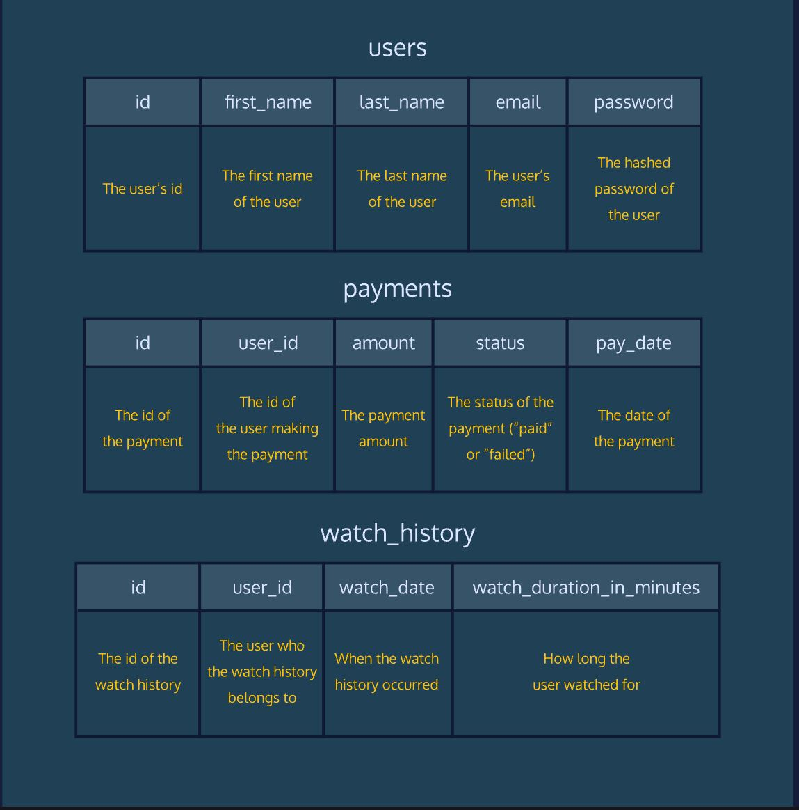

<h1>Codeflix Introduction</h1>
 
 
<b> The following challenge is from Code Academy's Analyze Data with SQL Skill Path Course </b>
 

Welcome to Code Challenge: Aggregate Functions!

A streaming video company, Codeflix, needs your help analyzing their user data. We’ve imported a portion of their dataset into the SQL workspace for this lesson.

The database contains 3 tables:

<b>users</b> contains the basic account details for each user 
<b>payments</b> contains payment details for a 3 month period 
<b>watch history</b> contains watch events for the users 

The database schema is as follows:  

