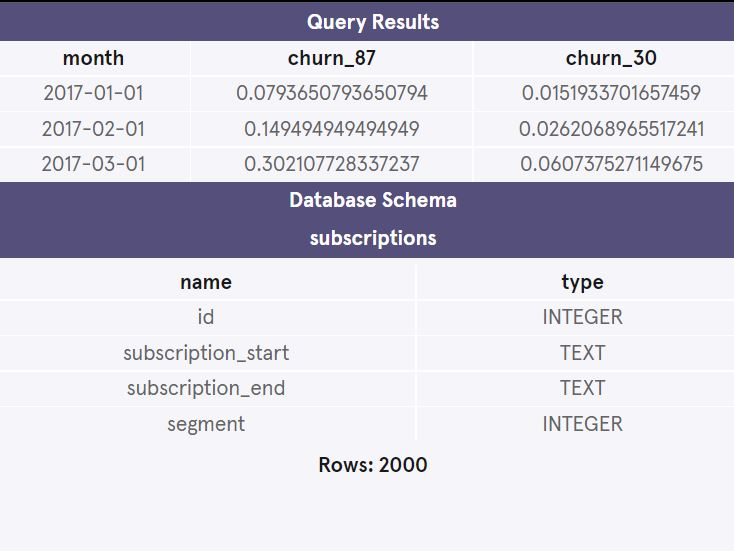

<h1>Calculating Churn Rates Project</h1> 
Four months into launching Codeflix, management asks you to look into subscription churn rates. It’s early on in the business and people are excited to know how the company is doing.
 
 
The marketing department is particularly interested in how the churn compares between two segments of users. They provide you with a dataset containing subscription data for users who were acquired through two distinct channels.
 
 
The dataset provided to you contains one SQL table, subscriptions. Within the table, there are 4 columns:
 
 

<strong>id</strong> - the subscription id 
<strong>subscription_start</strong> - the start date of the subscription 
<strong>subscription_end</strong>- the end date of the subscription 
<strong>segment</strong> - this identifies which segment the subscription owner belongs to
Codeflix requires a minimum subscription length of 31 days, so a user can never start and end their subscription in the same month. 
 
<h3>Database Schema and Query Results for the project</h3>

