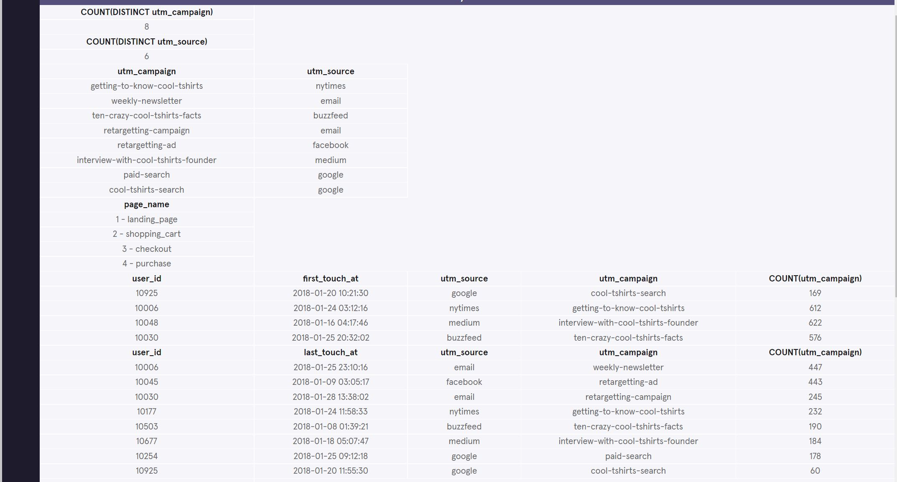
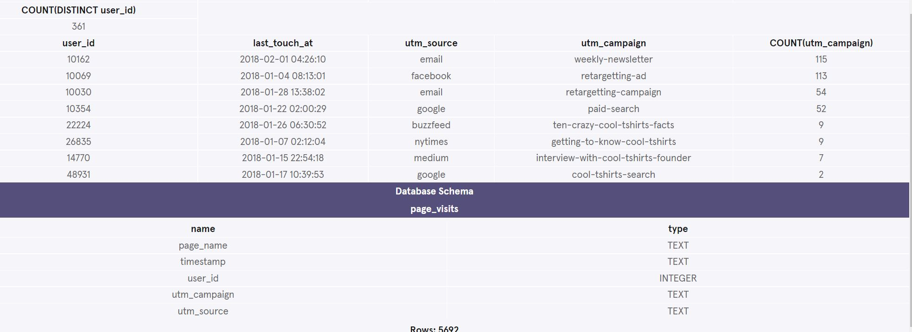

<h1>CoolTShirts Marketing Attribution Queries Project</h1>

  CoolTShirts sells shirts of all kinds, as long as they are T-shaped and cool.  
  Recently, CTS started a few marketing campaigns to increase website visits and purchases. 
  
  Using touch attribution, they’d like to map their customers’ journey: from initial visit to purchase. 
  They can use that information to optimize their marketing campaigns.

 
 

<h4>Database Schema</h4>

 
 
<h4>Overall Results from my queries</h4>

