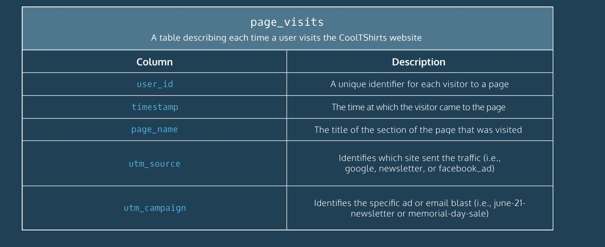

<h1>CoolTShirts Marketing Attribution Queries Project</h1>

  CoolTShirts sells shirts of all kinds, as long as they are T-shaped and cool. 
  Recently, CTS started a few marketing campaigns to increase website visits and purchases. 
  
  Using touch attribution, they’d like to map their customers’ journey: from initial visit to purchase.
  They can use that information to optimize their marketing campaigns.

<h4>Database Schema</h4>

