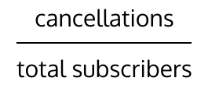
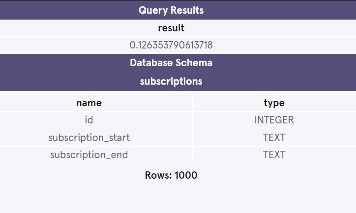

<h1> Calculating Churn Rates in SQL</h1>
   How to calculate Churn Rates in SQL: In this example, we’ll calculate churn for the month of December 2016.   
Typically, there will be data in a subscriptions table available in the following format: 
<b>id</b> - the customer id  
<b>subscription_start</b> - the subscribe date 
<b>subscription_end</b> - the cancel date
   
  When customers have a NULL value for their subscription_end, that’s a good thing. It means they haven’t canceled! 
   
<h3>How to calculate Churn Rates</h3>  
<h3>Overall result for this example and Database Schema </h3> 
