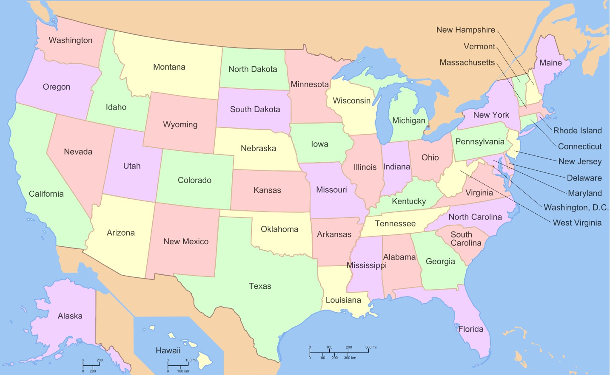

<h1>Practice with Windows Functions (Climate Change Project)</h1>

To practice what you’ve learned about window functions, you are going to use climate data from each state in the United States.
  A labeled map of the United States can be found here:  

 
This data will show the average annual temperature for each state – this is the average temperature of every day in all parts of the state for that year.
 

For this project, you will be working with one table:

<strong>state_climate</strong>
