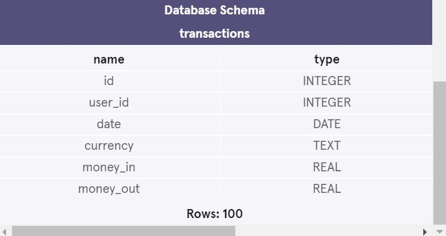

<h1>Crypto Currency Exchange Project </h1>  
<b> This project is from Code Academy's Analyze Data With SQL Skill Path - Calculating Aggregates course </b>  

Fiddy Cent is a digital currency exchange headquartered in Neo Tokyo. 
 They broker exchanges of Bitcoin, Bitcoin Cash, Ethereum, and Litecoin with fiat currencies in around 50 countries.

Help them analyze their January ledger data using SQL aggregate functions!   You are given the <b>transactions</b> table, which contains both <b>money-in</b> and <b>money-out</b> transactions.
 
 
<h3>The Database Schema for the Transactions table: </h3>  

