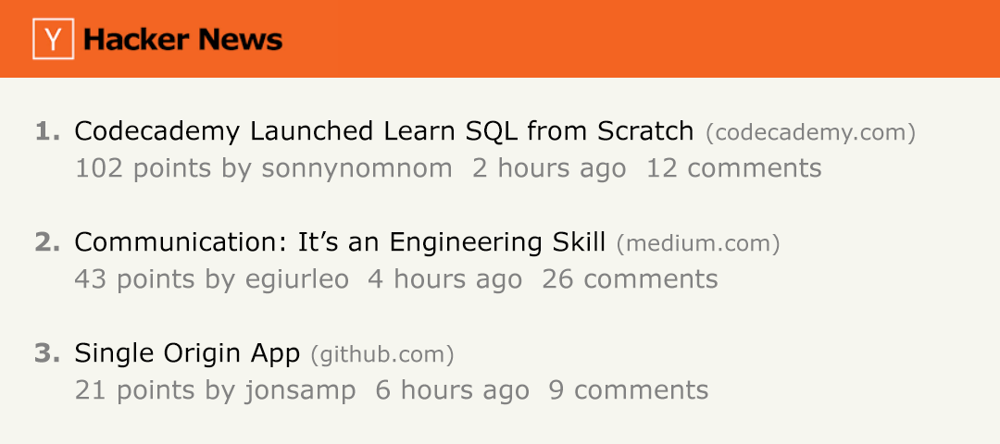

<h1>How to Hack Hacker News.</h1>  

<b> This project is from Code Academy's 'Analyze Data with SQL Skill Path' Course - Section: Calculating Aggregates</b>

The Metropolitan Museum of Art of New York is one of the world’s largest and finest art museums. 
In this project, I worked with a table named met that contains the museum’s collection of American Decorative Arts.
 
 
It has the following columns: 

Hacker News is a popular website run by Y Combinator. 
It’s widely known by people in the tech industry as a community site for sharing news, showing off projects, asking questions, among other things.

In this project, I will be working with a table named hacker_news that contains stories from Hacker News since its launch in 2007. It has the following columns:

<b>title</b>: the title of the story 
<b>user</b>: the user who submitted the story 
<b>score</b>: the score of the story 
<b>timestamp</b>: the time of the story 
<b>url</b>: the link of the story 
This data was kindly made publicly available under the MIT license.

