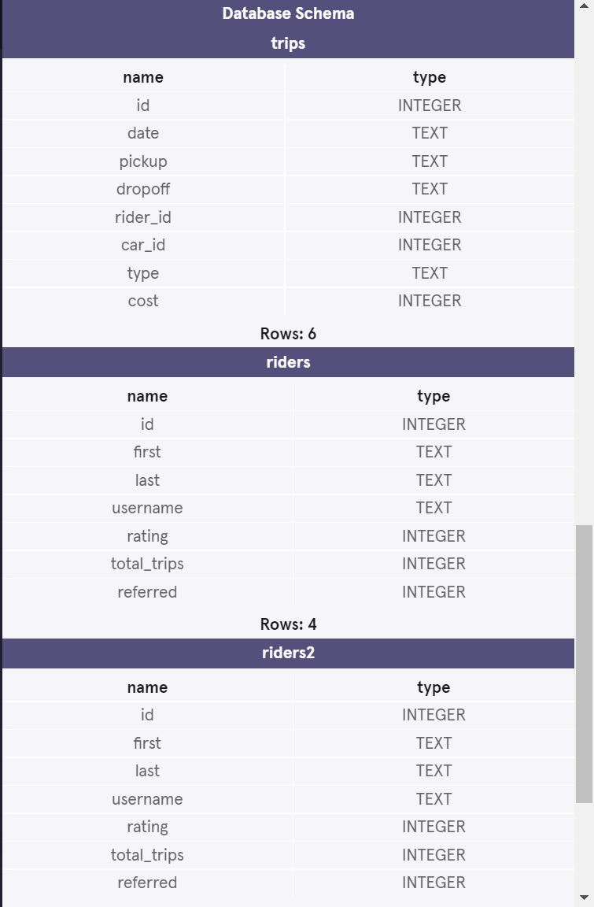

<h1>Lyft Trip Data</h1>
<b>Project from Code Academy's Analyzing Data with SQL</b>  
Practice for joins by combining rows from different tables.

Suppose you are a Data Analyst at Lyft, a ride-sharing platform. For a project, you were given three tables:

<b>trips</b>: trips information 
<b>riders</b>: user data 
<b>cars</b>: autonomous cars

