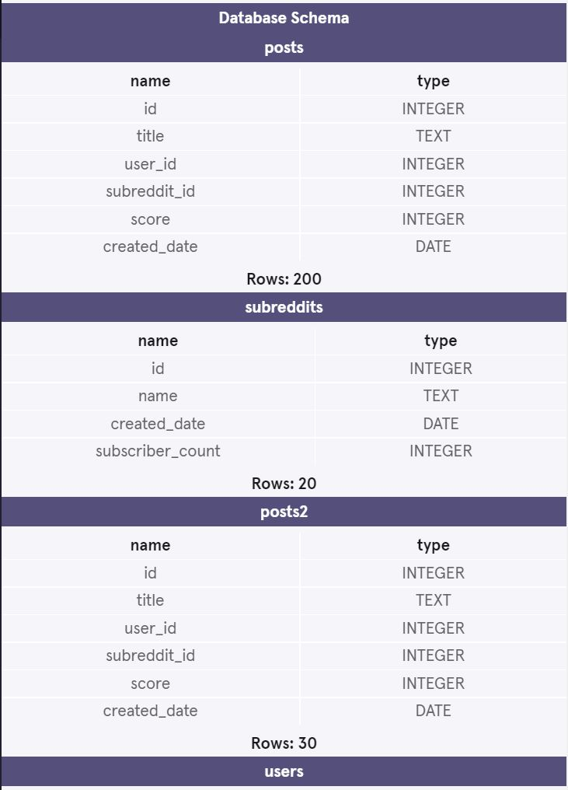

<h1>Multiple Tables Reddit Project</h1>
 
 
<b>This project is from Codecademy's "Analyze Data with SQL Skill Path" Course</b>

For this project, I was working as a Data Analyst who was in charge of examining some fictional data from Reddit, a social news aggregation, content rating site.
 
 
On Reddit, users can create posts with content such as text, media, and links to other websites. Users can post content to different communities known as subreddits, which focus on a particular topic. Users can then rate others’ content by upvoting or downvoting them, and each post will show its total cumulative score.
 
 
For the task I was given three tables:
 
 
<b>users</b>: users data 
<b>posts</b>: posts information 
<b>subreddits</b>: information about subreddits   

<h2> Database Schema's Used </h2>
 
 
