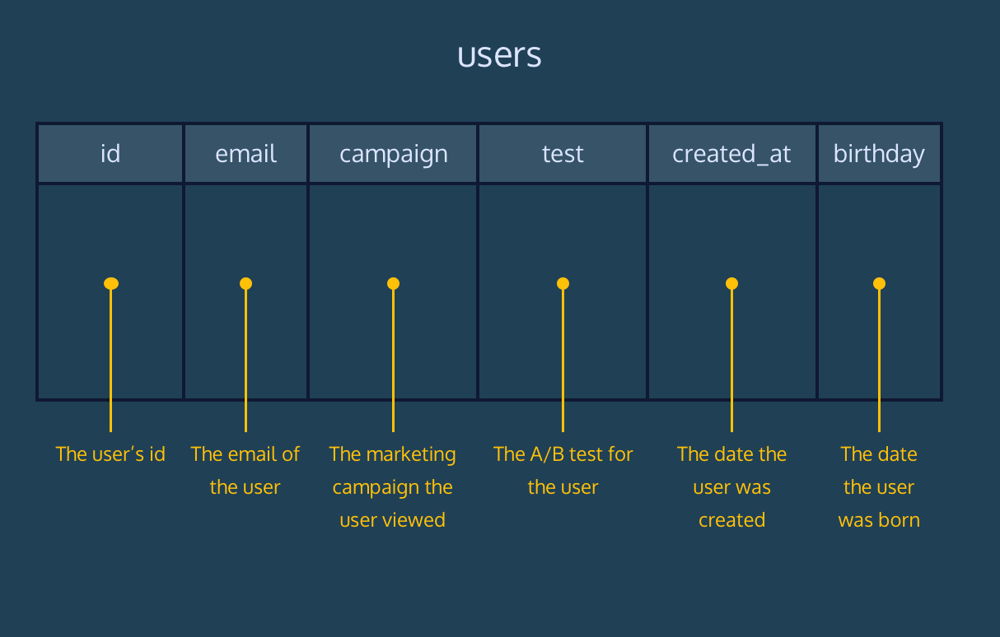

<h1> RPA Customer Segmentation</h1>
 

<b> The following is from CodingAcademy's Analyze Data with SQL Skill Path Project </b>
 
 
The marketing department of Reputable Product Agency (RPA) is looking to segment the company users by a number of different criteria.

In this context, a segment is a subset of users that meet different conditions. Segments are used to send marketing campaigns to users who meet specific criteria or to measure the performance of specific marketing campaigns.

Use SQL queries to generate user lists for the marketing department. The users dataset is imported into the workspace.

The schema of the table is available here: 
 

