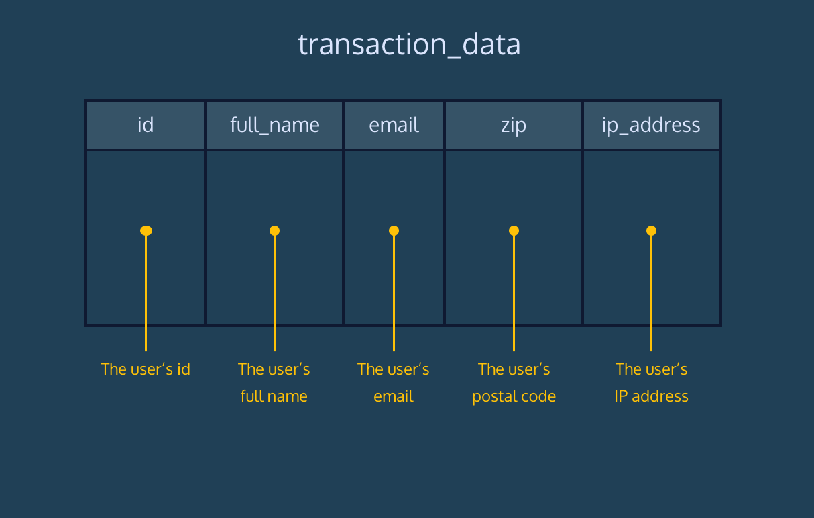

<strong>RPA Fraud Detection</strong>
  
Reputable Product Agency (RPA) has started receiving complaints from their credit card processor about fraudulent transactions. Help your finance department identify potentially risky transactions before they finish processing.

This dataset contains a single table, <b>transaction_data</b>. 

The schema of this table is available here:  

