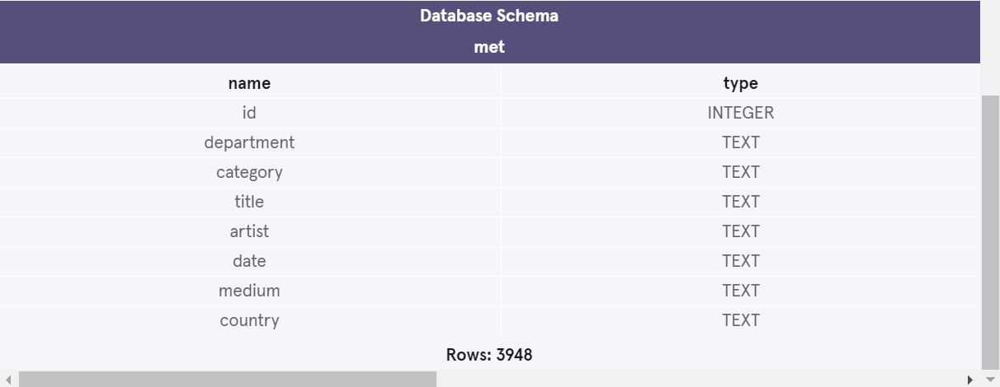

<h1>The Metropolitan Museum of Art of New York Project.</h1>  

<b> This project is from Code Academy's 'Analyze Data with SQL Skill Path' Course</b>

The Metropolitan Museum of Art of New York is one of the world’s largest and finest art museums. 
In this project, I worked with a table named met that contains the museum’s collection of American Decorative Arts.
 
 
It has the following columns: 

<b>id</b> - the id of the art piece 
<b>department</b> - the department of the art piece 
<b>category</b> - the category of the art piece 
<b>title</b> - the title name of the art piece 
<b>artist</b> - the name of the artist 
<b>date</b> - the date(s) of the art piece 
<b>medium</b> - the medium of the art piece 
<b>country</b> - the country of the artist 

