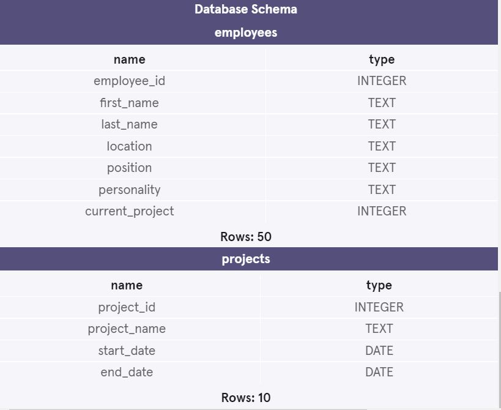

<h1>VR Startup Company</h1>  

<b>This project is from Codecademy's Analyze Data with SQL Skill Path </b> 

Codecademy Virtual Reality (CVR), Inc. is the latest startup on the VR scene. 
As head of the Project Completion team, you have been given a list of upcoming projects needing to be delivered.  My main responsibility is to analyze our current talent pool to ensure each project can be completed efficiently and effectively.

Each project needs a Project Manager, Team Lead, Designer, Database Administrator (DBA), and at least two Developers.
 

<h3>Database Schema for VR Startup Company</h3> 
 
